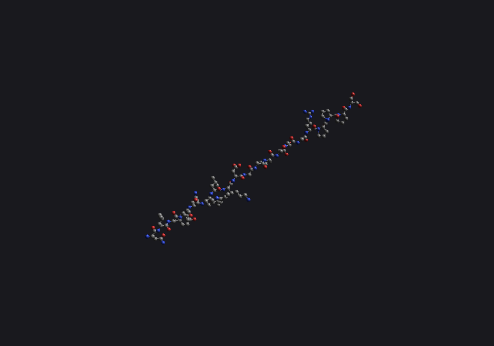
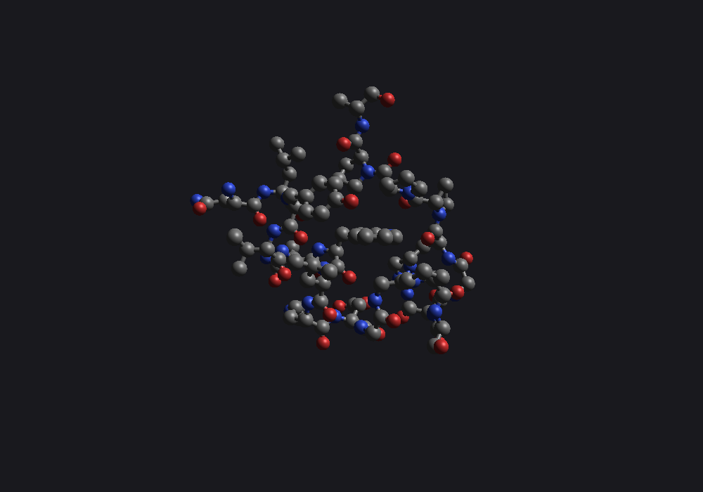
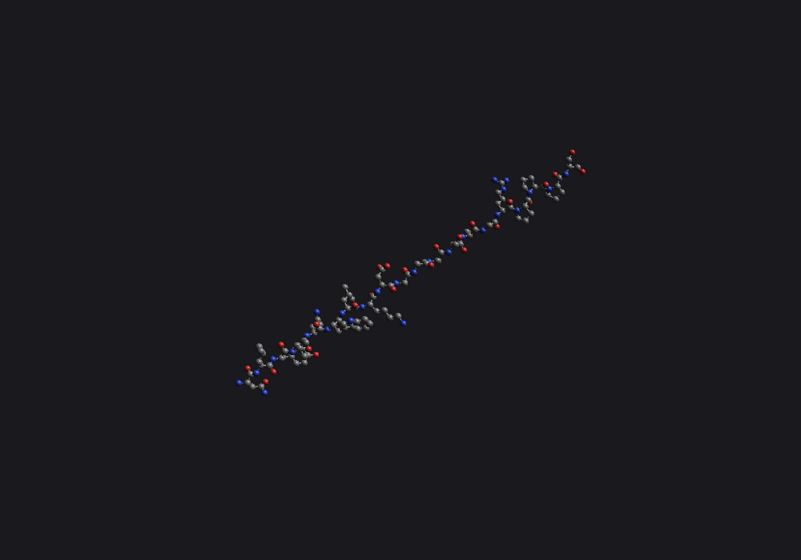
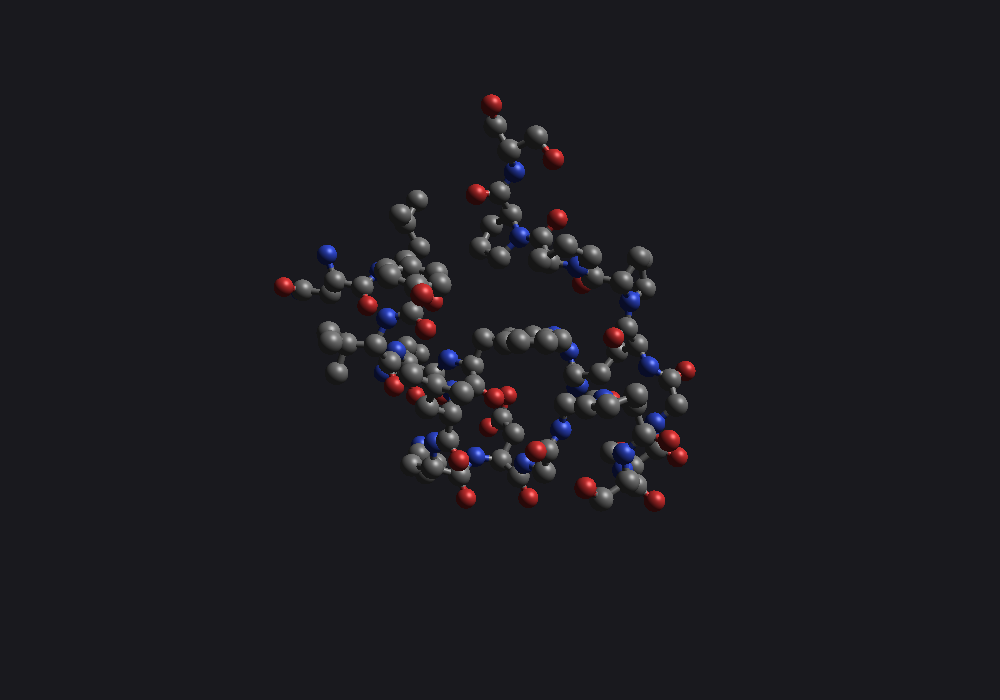
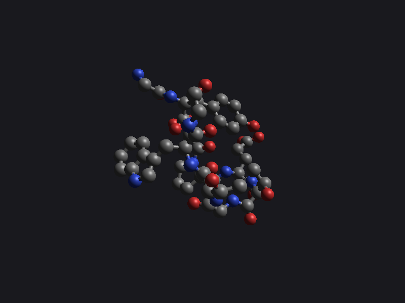
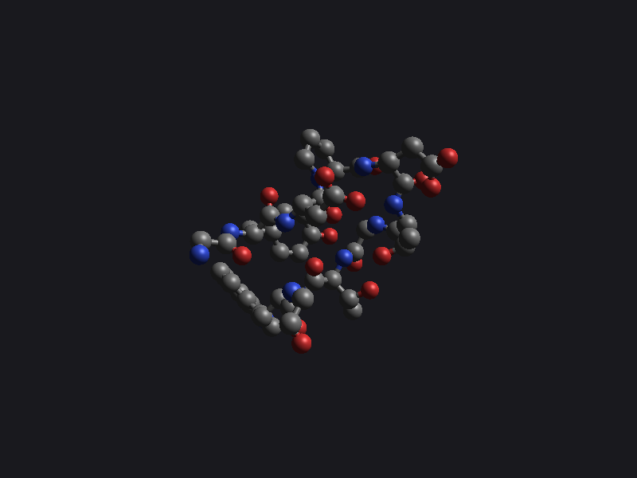
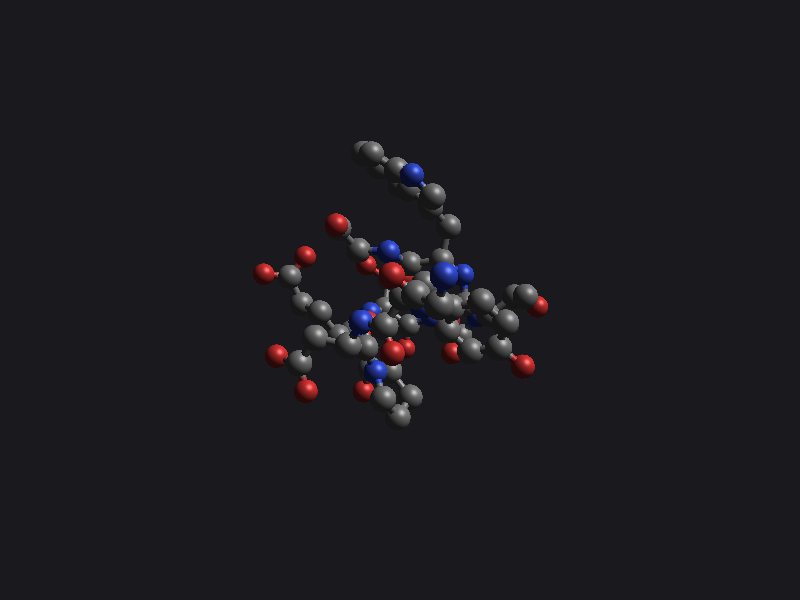
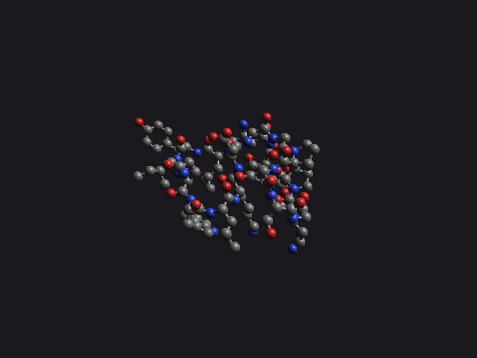

# origami

Experimental, deterministic, first-principles protein folding.

The goal is a pipeline that goes **mRNA sequence → amino-acid chain → 3D folded
structure**, simulated as the protein co-translationally emerges from a
ribosome under thermal motion at body temperature. Folding is driven only by
the physics of the chain — charge, hydrophobicity, hydrogen bonding, sterics,
dihedral preferences, codon-rarity translation timing, Brownian motion — with
no learned priors from structural databases.

It may not work. That is the experiment.

## The pipeline so far

Take the 20-residue Trp-cage mini-protein, `NLYIQWLKDGGPSSGRPPPS`.

**1. Build an all-atom 3D structure from the sequence (`origami build`).**
Every backbone atom and every side-chain atom is placed via NeRF from
idealised internal coordinates, in an extended β-strand conformation. This is
what `origami` starts with — no fold yet.



**2. Compare against the experimentally-determined native fold.** PDB 1L2Y
(NMR, Neidigh et al. 2002) is the reference. The compact tertiary structure
buries the central tryptophan (centre of the image) inside a cage of polyproline
helix and α-helix.



**3. Score and relax (`origami energy`, `origami minimize`).** The hand-built
CHARMM36-derived force field assigns native 1L2Y an energy 49,170 kJ/mol below
the extended chain, confirming the physics has the right direction. L-BFGS
minimisation on the extended chain drops the energy from +47,506 kJ/mol to
−1,789 kJ/mol in 115 steps — it relaxes local strain but cannot cross the
barriers between conformations, so the chain doesn't fold:



**4. Heat it up (`origami dynamics`).** BAOAB Langevin integration at 310 K
gives the chain thermal energy to wiggle, explore conformations, and (in
principle) cross barriers between minima. The frame below is a snapshot
from 3 ps of dynamics started from the native fold — the cage stays put but
visibly fluctuates, which is what implicit-solvent MD at body temperature
should look like:



**5. Grow it co-translationally (`origami cotranslate`).** A real chain
doesn't appear all at once — the ribosome emits residues N-to-C, and the
N-terminal portion has been folding for a while by the time the C-terminus
arrives. The cotranslate command alternates between appending one residue
and running Langevin dynamics for the time slice up to the next emission.
An optional cylindrical exit-tunnel constraint keeps the nascent chain
inside a confined region, mimicking the ribosomal tunnel.

Combined with `--with-sasa`, the hydrophobic-collapse term drives the
nascent chain as soon as enough side chains are present to cluster.
Chignolin (`GYDPETGTWG`, 10 residues, PDB 1UAO), one residue per 0.5 ps,
100 ps tail of Langevin at 310 K, γ = 2 ps⁻¹, hydrophobic γ-scale 0.25:


[Full quality MP4](docs/animations/chignolin_cotsasa.mp4) ·
1 ps of simulated time per ~83 ms of video at 30 fps.

The Cα RMSD vs the 1UAO native fold over the 100 ps tail:

| time after emergence | Cα RMSD vs 1UAO native |
|---:|---:|
| ~4 ps (chain just complete) | 7.32 Å |
| 20 ps | 6.73 Å |
| 40 ps | 4.05 Å |
| **44 ps** (`docs/images/chignolin_cotsasa_43ps.png`) | **2.94 Å** (minimum) |
| 100 ps | 3.06 Å |

Full trace: [docs/data/chignolin_cotsasa_rmsd.tsv](docs/data/chignolin_cotsasa_rmsd.tsv).
The chain compacts from extended (7.3 Å) into a sub-3 Å native-like
basin during the tail. Compared to the pre-folded baseline below
(1.82 Å from a pre-minimised extended chain), the cotranslational
version reaches a slightly higher RMSD floor — the chain spends its
first few ps growing rather than folding, so it has less wall-clock
time available to relax. But the qualitative behaviour is the same:
emerge, collapse, hover in a compact basin.

**6. Actually fold something.** Start from a minimised extended chignolin
(GYDPETGTWG, 10 residues) and run Langevin dynamics at 310 K. With just
LJ + Coulomb + GB (no hydrophobic forces) over 500 ps:

| frame (× 10 ps) | Cα RMSD vs 1UAO native |
|---:|---|
| 0 (start) | 8.76 Å |
| 6 | 3.66 Å |
| 10 | 2.92 Å |
| 14 | 2.09 Å |
| **16** | **1.82 Å** — within NMR experimental uncertainty |
| 17–18 | 1.88, 2.01 Å |




Adding the analytical hydrophobic-SASA forces (PSA.2) accelerates
collapse. A γ-scaling sweep on the same starting structure and seed
shows the trade-off:

| γ scale | Min Cα RMSD vs 1UAO | Time to min | Sim length |
|---:|---:|---:|---:|
| 0.0 (no SASA) | **1.82 Å** | 160 ps | 500 ps |
| 0.25 | 2.04 Å | 100 ps | 200 ps |
| 0.5 | 2.37 Å | 48 ps | 200 ps |
| 1.0 (full literature γ) | 2.82 Å | 64 ps | 200 ps |

Full RMSD traces:
[no-SASA](docs/data/chignolin_rmsd.tsv) ·
[γ=0.25](docs/data/chignolin_sasa_g025_rmsd.tsv) ·
[γ=0.5](docs/data/chignolin_sasa_g050_rmsd.tsv) ·
[γ=1.0](docs/data/chignolin_sasa_rmsd.tsv).

Lower γ → tighter native fit (less molten-globule lock-in). The
γ=0.25 fold at 100 ps:



The sweet spot looks like γ ∈ [0.25, 0.5]: enough hydrophobic drive
to compact the chain ~2× faster than LJ+GB-only, without
over-stabilising the first compact state it finds. The literature γ
of 5 cal/mol/Ų (our γ=1.0 baseline) appears to be too aggressive
for our combined CHARMM36 + OBC-GB force field. Tunable via the
`ORIGAMI_SASA_GAMMA_SCALE` environment variable.

Either way: the central hypothesis — that hand-built physics
produces reasonable folds without ML priors — is at least true for
the smallest known fold, both with and without hydrophobic forces.

**Trp-cage fold trial.** Same setup on the 20-residue Trp-cage
(NLYIQWLKDGGPSSGRPPPS, starting Cα RMSD 16.66 Å vs the 1L2Y NMR
structure), 300 ps Langevin at γ=0.25. The chain compacts steadily
from 16.66 Å → 4.20 Å (frame 35 / 210 ps) and stabilises in a
~4.2 Å plateau through to 300 ps:



Trace: [docs/data/trpcage_sasa_g025_rmsd.tsv](docs/data/trpcage_sasa_g025_rmsd.tsv).

Not the native fold — Trp-cage folds in ~5 μs experimentally, and
our 300 ps run is ~16 000× short of that — but a clear hydrophobic
collapse to a compact molten globule. The chain didn't diverge,
didn't get stuck extended, and didn't blow through the native basin.
To reach the actual 1L2Y fold would need a much longer trajectory
(milliseconds of simulated time, or replica exchange).

## Status

Done so far: translation (M1), all-atom chain building (M2), energy evaluation
with CHARMM36-borrowed constants and GB OBC II implicit solvent (M3), energy
minimisation with L-BFGS (M4), BAOAB Langevin dynamics with trajectory
rendering (M5), exact analytical SASA via spherical Gauss-Bonnet (PSA.1, ~1%
match to Shrake-Rupley), numerical SASA forces in the gradient (PSA.2),
co-translational chain growth with optional exit-tunnel constraint (M6), and
validation against three small folds (M7): chignolin (1UAO), Trp-cage (1L2Y),
and villin headpiece HP-35 (2F4K). For each, the native fold scores at least
30 000 kJ/mol below the same sequence built as an extended chain, and 2 ps of
Langevin dynamics from the Trp-cage native conformation keeps Cα RMSD under
1 Å.

Performance benchmarks (release build, single-core Apple Silicon):
- Trp-cage (300 atoms), no SASA: **885 fs/s** (≈ 76 ns/day)
- Trp-cage, **with** analytical SASA: ~30 fs/s (≈ 2.6 ns/day)
- Chignolin (134 atoms), no SASA: **3 509 fs/s** (≈ 303 ns/day)
- Force-term breakdown on Trp-cage (1.16 ms/step without SASA):
  nonbonded LJ+Coulomb 0.38 ms (33 %), GB 0.71 ms (61 %), all bonded
  terms together 0.06 ms (5 %), analytical SASA 31 ms when enabled.
- Numerical-vs-analytical SASA force: 10 048 ms → 31 ms per step
  (325× speedup, max numerical-vs-analytical agreement 4.5×10⁻⁹).
- SoA-flat exclusion bitmap on nonbonded pair loop: kernel-level 3.3×
  speedup on Trp-cage (1.25 → 0.38 ms), 1.7× on the whole force
  evaluation (2.0 → 1.16 ms).

Up next: SoA on the GB Born-radii integral, parallel force evaluation
across cores, then larger folds and longer trajectories.

## Build

```sh
cargo build --workspace
cargo test --workspace
```

## CLI quick reference

```sh
# mRNA FASTA → amino-acid sequence
origami translate examples/insulin.fasta

# Sequence → all-atom PDB (extended chain)
origami build --seq NLYIQWLKDGGPSSGRPPPS --output trp_cage.pdb

# Energy of a structure with per-term breakdown
origami energy trp_cage.pdb

# L-BFGS or steepest-descent minimisation
origami minimize trp_cage.pdb --output trp_cage_min.pdb --algorithm lbfgs

# BAOAB Langevin dynamics at 310 K — writes a multi-MODEL trajectory PDB
origami dynamics trp_cage_min.pdb --output-trajectory traj.pdb \
    --steps 3000 --save-every 100 --temperature 310 --friction 5.0

# Co-translational chain growth — append one residue, then run dynamics
# until the ribosome emits the next residue. Optional cylindrical exit
# tunnel mimics the ribosomal tunnel.
origami cotranslate --seq NLYIQWLKDGGPSSGRPPPS --output-trajectory cotrans.pdb \
    --interval 500 --tail 5000 --save-every 50 --with-tunnel

# Render single-frame or trajectory (multi-MODEL → frame_NNNN.png per model)
origami render trp_cage.pdb --output trp_cage.png --width 800 --height 600
origami render traj.pdb --output-dir frames/ --width 800 --height 600

# Trajectory analysis: per-frame Cα RMSD, Rg, end-to-end; residue-residue
# contact-frequency map averaged over fully-grown frames.
origami analyze cotrans.pdb \
    --reference crates/io/tests/fixtures/1UAO_chignolin.pdb \
    --output metrics.tsv \
    --contact-map contacts.tsv --contact-cutoff 8.0
```

## Layout

```
crates/
  chem/       — atom/AA/codon data, CHARMM36 parameter loader, atom typing
  translate/  — mRNA → amino-acid chain
  geom/       — 3D math, NeRF, all-atom chain builder, topology graph, cell list
  io/         — PDB writer + reader, PNG renderer
  energy/     — bonded + LJ + Coulomb + GB OBC II + SASA, plus analytical forces
  dynamics/   — backtracking line search, steepest descent, L-BFGS minimisation,
                BAOAB Langevin integrator + xoshiro256++ PRNG
  cli/        — `origami` binary
data/charmm36 — vendored CHARMM36m parameter and topology files
```

## License

MIT. CHARMM36 parameter files vendored under `data/charmm36/` are
redistributed for academic use; see the headers inside those files for
attribution.
